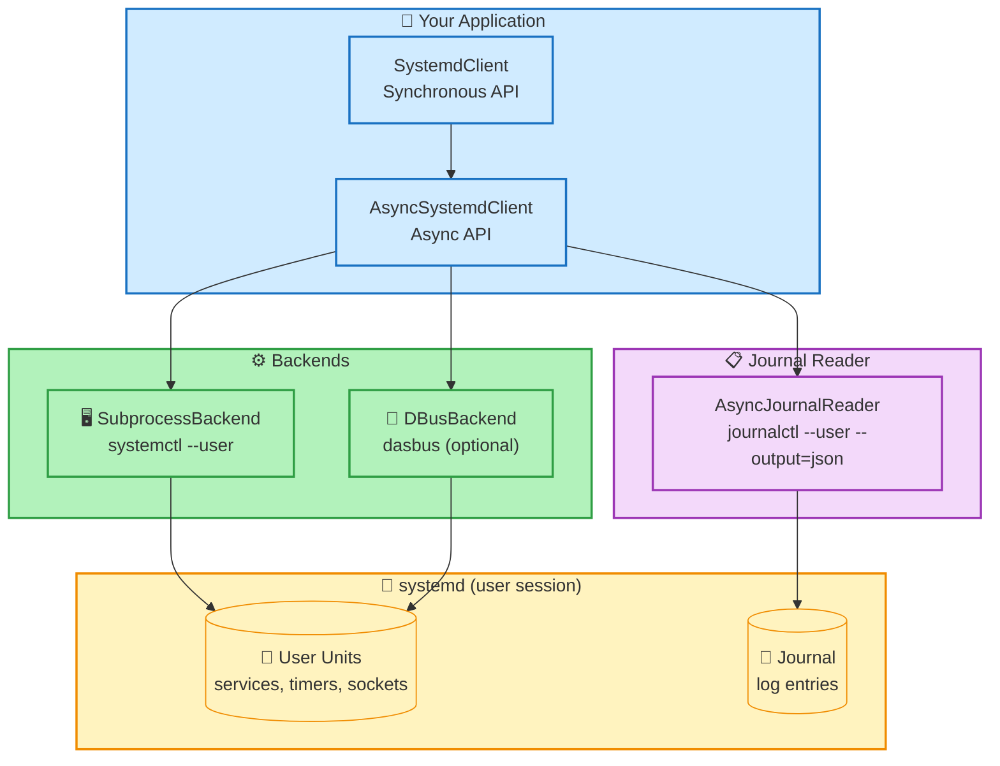
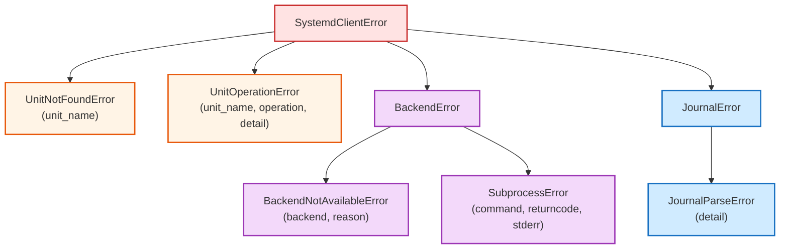

# systemd-client — High-Level Python Client for systemd User Services

<div align="center">

[](README.md)
[](README.es.md)


**Unified async + sync Python API for systemd unit management and journal reading**

</div>

---

## Table of Contents

| # | Section | # | Section |
|:-:|---------|:-:|---------|
| 1 | [Introduction](#introduction) | 7 | [Journal Reader](#-journal-reader) |
| 2 | [Architecture](#-architecture) | 8 | [CLI](#-cli) |
| 3 | [Quick Start](#-quick-start) | 9 | [Exception Hierarchy](#-exception-hierarchy) |
| 4 | [Prerequisites](#-prerequisites) | 10 | [Optional Pydantic Models](#-optional-pydantic-models) |
| 5 | [Project Structure](#-project-structure) | 11 | [Test Infrastructure](#-test-infrastructure) |
| 6 | [Public API Reference](#-public-api-reference) | 12 | [Troubleshooting](#-troubleshooting) |

---

## Introduction

The **systemd-client** library provides a modern, well-typed Python API for managing systemd user-space services (`systemd --user`). No existing library offers a unified async + sync interface covering both unit management and journal reading with pluggable backends. This fills that gap.

### Key Features

| | Feature | Detail |
|:-:|---------|--------|
| **🔄** | **Async + Sync** | Async-first design with synchronous wrappers — use either API style |
| **⚙️** | **Pluggable Backends** | Subprocess (default) or D-Bus via dasbus (optional) |
| **📋** | **Journal Reading** | Query and follow journal entries with structured `JournalEntry` objects |
| **🔧** | **Unit Management** | Start, stop, restart, reload, enable, disable, mask, unmask, status |
| **📊** | **Typed Models** | Frozen dataclasses with full type annotations — optional Pydantic support |
| **🖥️** | **CLI Included** | `systemd-client` command with table and JSON output |
| **🐍** | **Modern Python** | Python 3.11+ with StrEnum, slots, PEP 561 typing |

---

## 🏗️ Architecture



### Async Strategy

- All backend operations are implemented as `async def`
- **Subprocess backend**: uses `asyncio.create_subprocess_exec` natively
- **DBus backend**: wraps synchronous dasbus calls via `asyncio.to_thread()`
- **Sync client**: wraps `AsyncSystemdClient` method-by-method via `run_sync()` helper
- **Journal follow**: async generator is the canonical implementation; sync version bridges via thread + queue

### Why Journal Always Uses Subprocess

The systemd journal has **no D-Bus API**. The only portable approach is `journalctl --user --output=json`. This works regardless of backend choice.

---

## ⚡ Quick Start

```bash
# Install base package (subprocess backend)
pip install systemd-client

# Install with D-Bus backend support
pip install systemd-client[dbus]

# Install with optional Pydantic models
pip install systemd-client[pydantic]

# Install everything
pip install systemd-client[all]

# Development install
pip install systemd-client[dev]
```

### Sync Usage

```python
from systemd_client import SystemdClient

client = SystemdClient()

# List all user services
for unit in client.list_units(unit_type="service"):
    print(f"{unit.name}: {unit.active_state} ({unit.sub_state})")

# Unit operations
client.start("my-app.service")
client.restart("my-app.service")
status = client.status("my-app.service")
print(f"PID: {status.main_pid}, State: {status.active_state}")

# Journal
entries = client.journal("my-app.service", lines=50, since="1h ago")
for entry in entries:
    print(f"[{entry.priority}] {entry.message}")

# Follow journal (blocking iterator)
for entry in client.journal_follow("my-app.service"):
    print(entry.message)
```

### Async Usage

```python
import asyncio
from systemd_client import AsyncSystemdClient

async def main():
    client = AsyncSystemdClient()

    units = await client.list_units(unit_type="service")
    await client.restart("my-app.service")

    entries = await client.journal("my-app.service", lines=20)

    async for entry in client.journal_follow("my-app.service"):
        print(entry.message)

asyncio.run(main())
```

---

## 📋 Prerequisites

| Requirement | Detail | Default |
|-------------|--------|---------|
| **Python** | >= 3.11 | — |
| **Linux** | With systemd | — |
| **systemd user session** | `systemctl --user` must be functional | Active by default on most distros |
| **dasbus** (optional) | For D-Bus backend | Not required — subprocess backend works out of the box |
| **pydantic** (optional) | For Pydantic model variants | Not required |

> [!NOTE]
> The subprocess backend (default) requires only `systemctl` and `journalctl` on `PATH`. No additional system libraries are needed.

---

## 📁 Project Structure

```
systemd-client/
├── pyproject.toml                         # Build config (hatchling), extras, tools
├── LICENSE                                # LGPL-2.1-or-later
├── README.md                              # Language selector hub
├── README.en.md                           # English documentation
├── README.es.md                           # Spanish documentation
├── src/
│   └── systemd_client/
│       ├── __init__.py                    # Public API re-exports + __all__
│       ├── _version.py                    # __version__ = "0.1.0"
│       ├── _sync.py                       # run_sync() helper + sync generator bridge
│       ├── _unit_escape.py                # Unit name <-> DBus path escaping
│       ├── client.py                      # AsyncSystemdClient + SystemdClient
│       ├── enums.py                       # ActiveState, LoadState, UnitFileState, SubState,
│       │                                  #   UnitType, JournalPriority, BackendType
│       ├── exceptions.py                  # SystemdClientError hierarchy
│       ├── models.py                      # UnitInfo, UnitStatus, JournalEntry, EnableResult
│       ├── _pydantic_models.py            # Optional Pydantic BaseModel versions
│       ├── py.typed                       # PEP 561 marker
│       ├── backends/
│       │   ├── __init__.py                # get_backend() factory
│       │   ├── _base.py                   # AbstractBackend ABC
│       │   ├── _subprocess.py             # SubprocessBackend (systemctl/journalctl)
│       │   └── _dbus.py                   # DBusBackend (dasbus, optional)
│       ├── journal/
│       │   ├── __init__.py                # Re-exports
│       │   ├── _parser.py                 # JSON line parsing, field normalization
│       │   ├── _query.py                  # JournalQuery dataclass + to_args()
│       │   └── _reader.py                 # AsyncJournalReader + JournalReader
│       └── cli/
│           ├── __init__.py
│           ├── _app.py                    # argparse CLI entry point
│           └── _formatters.py             # Table + JSON output formatting
└── tests/
    ├── conftest.py                        # Shared fixtures, mock factories
    ├── test_enums.py
    ├── test_exceptions.py
    ├── test_models.py
    ├── test_unit_escape.py
    ├── test_client.py
    ├── backends/
    │   └── test_subprocess.py
    ├── journal/
    │   ├── test_parser.py
    │   ├── test_query.py
    │   └── test_reader.py
    └── cli/
        └── test_app.py
```

---

## 🔌 Public API Reference

### Client Instantiation

```python
from systemd_client import SystemdClient, AsyncSystemdClient, BackendType

# Auto-detect backend (tries DBus, falls back to subprocess)
client = SystemdClient()

# Explicit backend selection
client = SystemdClient(backend=BackendType.SUBPROCESS)
client = SystemdClient(backend=BackendType.DBUS)

# Async equivalent
async_client = AsyncSystemdClient(backend=BackendType.AUTO)
```

### Unit Management Methods

| Method | Return Type | Description |
|--------|------------|-------------|
| `list_units(unit_type?, state?)` | `list[UnitInfo]` | List systemd user units with optional filters |
| `status(unit_name)` | `UnitStatus` | Detailed unit status |
| `start(unit_name)` | `None` | Start a unit |
| `stop(unit_name)` | `None` | Stop a unit |
| `restart(unit_name)` | `None` | Restart a unit |
| `reload(unit_name)` | `None` | Reload a unit |
| `enable(unit_name)` | `EnableResult` | Enable a unit |
| `disable(unit_name)` | `EnableResult` | Disable a unit |
| `mask(unit_name)` | `EnableResult` | Mask a unit |
| `unmask(unit_name)` | `EnableResult` | Unmask a unit |
| `is_active(unit_name)` | `bool` | Check if unit is active |
| `is_enabled(unit_name)` | `bool` | Check if unit is enabled |
| `is_failed(unit_name)` | `bool` | Check if unit has failed |
| `daemon_reload()` | `None` | Reload systemd daemon configuration |

### Journal Methods

| Method | Return Type | Description |
|--------|------------|-------------|
| `journal(unit?, lines?, since?, until?, priority?, grep?)` | `list[JournalEntry]` | Query journal entries |
| `journal_follow(unit?, lines?, priority?)` | `Iterator[JournalEntry]` | Follow journal in real-time |

### Data Models

#### UnitInfo (from `list_units`)

| Field | Type | Description |
|-------|------|-------------|
| `name` | `str` | Unit name (e.g. `my-app.service`) |
| `description` | `str` | Human-readable description |
| `load_state` | `LoadState` | loaded, not-found, bad-setting, error, masked |
| `active_state` | `ActiveState` | active, inactive, failed, activating, deactivating |
| `sub_state` | `SubState` | running, dead, exited, failed, etc. |
| `unit_file_state` | `UnitFileState \| None` | enabled, disabled, static, masked, etc. |

#### UnitStatus (from `status`)

Extends `UnitInfo` fields with:

| Field | Type | Description |
|-------|------|-------------|
| `fragment_path` | `str \| None` | Path to unit file |
| `active_enter_timestamp` | `datetime \| None` | When unit became active |
| `active_exit_timestamp` | `datetime \| None` | When unit stopped being active |
| `main_pid` | `int \| None` | Main process PID |
| `exec_main_status` | `int \| None` | Exit status of main process |
| `result` | `str \| None` | Result string (success, exit-code, etc.) |
| `triggered_by` | `list[str]` | Units that trigger this one |
| `documentation` | `list[str]` | Documentation URLs |
| `properties` | `dict[str, str]` | All raw properties from systemctl show |

#### JournalEntry

| Field | Type | Description |
|-------|------|-------------|
| `message` | `str` | Log message text |
| `priority` | `JournalPriority` | emerg(0) through debug(7) |
| `timestamp` | `datetime \| None` | Wall-clock timestamp (UTC) |
| `monotonic_timestamp` | `int \| None` | Monotonic timestamp in microseconds |
| `unit` | `str \| None` | Originating systemd unit |
| `syslog_identifier` | `str \| None` | Syslog identifier |
| `pid` | `int \| None` | Process ID |
| `uid` | `int \| None` | User ID |
| `boot_id` | `str \| None` | Boot ID |
| `hostname` | `str \| None` | Hostname |
| `cursor` | `str \| None` | Journal cursor (for resuming) |
| `fields` | `dict[str, str]` | All additional journal fields |

#### EnableResult

| Field | Type | Description |
|-------|------|-------------|
| `changes` | `list[tuple[str, str, str]]` | List of (action, source, destination) changes |
| `carries_install_info` | `bool` | Whether the unit has an [Install] section |

### Enums

All enums are `StrEnum` (Python 3.11+) — they work as plain strings:

| Enum | Values |
|------|--------|
| `ActiveState` | active, inactive, failed, activating, deactivating, reloading, maintenance |
| `LoadState` | loaded, not-found, bad-setting, error, masked |
| `UnitFileState` | enabled, disabled, static, masked, linked, indirect, generated, transient, bad, alias, enabled-runtime, linked-runtime, masked-runtime |
| `SubState` | running, dead, exited, failed, start-pre, start, start-post, stop, waiting, elapsed, mounted, ... |
| `UnitType` | service, socket, target, timer, path, mount, automount, swap, slice, scope, device |
| `JournalPriority` | 0 (emerg) through 7 (debug) |
| `BackendType` | auto, subprocess, dbus |

---

## 📋 Journal Reader

For low-level journal access independent of the main client:

```python
from systemd_client import JournalReader, JournalQuery, JournalPriority

reader = JournalReader()

# Query with filters
entries = reader.query(JournalQuery(
    unit="my-app.service",
    priority=JournalPriority.WARNING,
    lines=100,
    since="1h ago",
))

# Follow (blocking)
for entry in reader.follow(JournalQuery(unit="my-app.service")):
    print(f"[{entry.priority}] {entry.message}")
```

### JournalQuery Parameters

| Parameter | Type | Description |
|-----------|------|-------------|
| `unit` | `str \| None` | Filter by unit name |
| `lines` | `int \| None` | Number of recent lines |
| `since` | `str \| None` | Show entries since (e.g. `"1h ago"`, `"2024-01-01"`) |
| `until` | `str \| None` | Show entries until |
| `priority` | `JournalPriority \| None` | Minimum priority level |
| `grep` | `str \| None` | Filter by regex pattern |
| `boot` | `str \| None` | Filter by boot ID |
| `reverse` | `bool` | Reverse chronological order |
| `follow` | `bool` | Follow new entries |
| `identifiers` | `list[str]` | Filter by syslog identifiers |

---

## 🖥️ CLI

The `systemd-client` command provides a CLI interface:

```bash
# List all user units
systemd-client list

# List only services
systemd-client list --type service

# Unit status
systemd-client status my-app.service

# Unit operations
systemd-client start my-app.service
systemd-client stop my-app.service
systemd-client restart my-app.service

# Enable/disable
systemd-client enable my-app.service
systemd-client disable my-app.service

# Reload daemon
systemd-client daemon-reload

# Journal
systemd-client journal --unit my-app.service --lines 50
systemd-client journal --unit my-app.service --follow
systemd-client journal --priority warning --since "1h ago"

# JSON output
systemd-client --json list
systemd-client --json status my-app.service

# Select backend
systemd-client --backend subprocess list

# No color output
systemd-client --no-color list
```

### CLI Commands

| Command | Arguments | Description |
|---------|-----------|-------------|
| `list` | `--type`, `--state` | List units |
| `status` | `UNIT` | Show unit status |
| `start` | `UNIT` | Start a unit |
| `stop` | `UNIT` | Stop a unit |
| `restart` | `UNIT` | Restart a unit |
| `reload` | `UNIT` | Reload a unit |
| `enable` | `UNIT` | Enable a unit |
| `disable` | `UNIT` | Disable a unit |
| `mask` | `UNIT` | Mask a unit |
| `unmask` | `UNIT` | Unmask a unit |
| `daemon-reload` | — | Reload systemd daemon |
| `journal` | `--unit`, `--lines`, `--since`, `--until`, `--priority`, `--grep`, `--follow` | Query/follow journal |

### Global Flags

| Flag | Description |
|------|-------------|
| `--backend` | Backend: `auto`, `subprocess`, `dbus` |
| `--json` | Output as JSON |
| `--no-color` | Disable colored output |
| `--version` | Show version |

---

## 🔍 Exception Hierarchy



```python
from systemd_client import (
    SystemdClientError,       # Base — catch all
    UnitNotFoundError,        # Unit does not exist
    UnitOperationError,       # start/stop/etc. failed
    BackendError,             # Backend-level failure
    BackendNotAvailableError, # Requested backend unavailable
    SubprocessError,          # systemctl command failed
    JournalError,             # Journal-level failure
    JournalParseError,        # Could not parse journal JSON
)
```

---

## 📊 Optional Pydantic Models

When installed with `pip install systemd-client[pydantic]`:

```python
from systemd_client._pydantic_models import (
    UnitInfoModel,
    UnitStatusModel,
    JournalEntryModel,
    EnableResultModel,
)

# These mirror the dataclass models but as Pydantic BaseModel (frozen)
# Useful for API serialization, validation, JSON Schema generation
```

---

## 🧪 Test Infrastructure

### Running Tests

```bash
# Install dev dependencies
pip install -e ".[dev]"

# Run all tests
pytest tests/ -v

# Run with coverage
pytest tests/ -v --cov=src/systemd_client

# Run specific test module
pytest tests/test_enums.py -v

# Run specific test class
pytest tests/backends/test_subprocess.py::TestListUnits -v
```

### Test Structure

| Directory | Tests | Description |
|-----------|-------|-------------|
| `tests/` | `test_enums.py` | All StrEnum values and behavior |
| `tests/` | `test_exceptions.py` | Exception hierarchy and messages |
| `tests/` | `test_models.py` | Dataclass creation, immutability, defaults |
| `tests/` | `test_unit_escape.py` | DBus path escaping roundtrips |
| `tests/` | `test_client.py` | Sync + async client with mocked backend |
| `tests/backends/` | `test_subprocess.py` | Subprocess backend with mocked systemctl |
| `tests/journal/` | `test_parser.py` | JSON line parsing |
| `tests/journal/` | `test_query.py` | JournalQuery argument building |
| `tests/journal/` | `test_reader.py` | Reader with mocked subprocess |
| `tests/cli/` | `test_app.py` | CLI commands with mocked client |

### Type Checking and Linting

```bash
# Type check
pyright src/

# Lint
ruff check src/ tests/

# Build verification
uv build
```

---

## 🔍 Troubleshooting

### systemctl --user fails with "Failed to connect to bus"

```bash
# Check if user session is active
loginctl show-user $(whoami) | grep Linger

# Enable linger for user services to persist
loginctl enable-linger $(whoami)

# Verify XDG_RUNTIME_DIR is set
echo $XDG_RUNTIME_DIR
```

> [!IMPORTANT]
> `loginctl enable-linger` is required for user services to run when the user is not logged in.

### DBus backend raises BackendNotAvailableError

```bash
# Install dasbus
pip install systemd-client[dbus]

# Verify D-Bus session bus is accessible
dbus-send --session --dest=org.freedesktop.systemd1 \
  --print-reply /org/freedesktop/systemd1 \
  org.freedesktop.DBus.Peer.Ping
```

> [!TIP]
> If D-Bus is not available, use `BackendType.SUBPROCESS` explicitly — it requires no extra dependencies.

### Journal queries return empty results

```bash
# Check if user journal has entries
journalctl --user --lines 5

# Check specific unit
journalctl --user -u my-app.service --lines 5

# Verify journal storage
systemctl --user status systemd-journald
```

> [!NOTE]
> Some systems may not persist user journal entries across reboots. Check `/etc/systemd/journald.conf` for `Storage=` settings.

### Import errors after installation

```bash
# Verify installation
pip show systemd-client

# Check Python version (requires 3.11+)
python3 --version

# Verify import
python3 -c "from systemd_client import SystemdClient; print('OK')"
```

---

<div align="center">

**systemd-client** · [github.com/kalexnolasco/systemd-client](https://github.com/kalexnolasco/systemd-client)

[Language Selection](README.md) · [Documentacion en Espanol](README.es.md)

&copy; 2026 kalexnolasco

</div>
