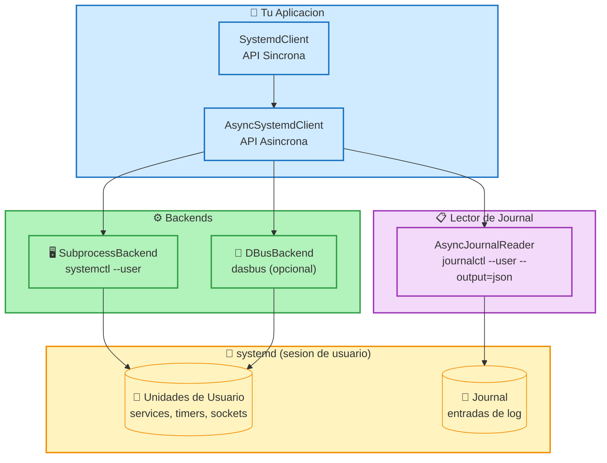
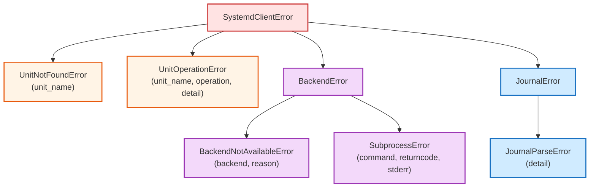

# systemd-client — Cliente Python de Alto Nivel para Servicios systemd de Usuario

<div align="center">

[](README.md)
[](README.en.md)


**API unificada async + sync en Python para gestion de unidades systemd y lectura del journal**

</div>

---

## Tabla de Contenidos

| # | Seccion | # | Seccion |
|:-:|---------|:-:|---------|
| 1 | [Introduccion](#introduccion) | 7 | [Lector de Journal](#-lector-de-journal) |
| 2 | [Arquitectura](#-arquitectura) | 8 | [CLI](#-cli) |
| 3 | [Inicio Rapido](#-inicio-rapido) | 9 | [Jerarquia de Excepciones](#-jerarquia-de-excepciones) |
| 4 | [Prerequisitos](#-prerequisitos) | 10 | [Modelos Pydantic Opcionales](#-modelos-pydantic-opcionales) |
| 5 | [Estructura del Proyecto](#-estructura-del-proyecto) | 11 | [Infraestructura de Test](#-infraestructura-de-test) |
| 6 | [Referencia de la API Publica](#-referencia-de-la-api-publica) | 12 | [Resolucion de Problemas](#-resolucion-de-problemas) |

---

## Introduccion

La libreria **systemd-client** proporciona una API Python moderna y tipada para gestionar servicios systemd en espacio de usuario (`systemd --user`). Ninguna libreria existente ofrece una interfaz unificada async + sync que cubra tanto la gestion de unidades como la lectura del journal con backends intercambiables. Esta libreria llena ese hueco.

### Caracteristicas Principales

| | Caracteristica | Detalle |
|:-:|---------|--------|
| **🔄** | **Async + Sync** | Diseno async-first con wrappers sincronos — usa cualquier estilo de API |
| **⚙️** | **Backends Intercambiables** | Subprocess (por defecto) o D-Bus via dasbus (opcional) |
| **📋** | **Lectura de Journal** | Consulta y sigue entradas del journal con objetos `JournalEntry` estructurados |
| **🔧** | **Gestion de Unidades** | Start, stop, restart, reload, enable, disable, mask, unmask, status |
| **📊** | **Modelos Tipados** | Dataclasses frozen con anotaciones de tipo completas — soporte opcional de Pydantic |
| **🖥️** | **CLI Incluido** | Comando `systemd-client` con salida en tabla y JSON |
| **🐍** | **Python Moderno** | Python 3.11+ con StrEnum, slots, tipado PEP 561 |

---

## 🏗️ Arquitectura



### Estrategia Asincrona

- Todas las operaciones de backend estan implementadas como `async def`
- **Backend subprocess**: usa `asyncio.create_subprocess_exec` nativamente
- **Backend DBus**: envuelve las llamadas sincronas de dasbus via `asyncio.to_thread()`
- **Cliente sincrono**: envuelve `AsyncSystemdClient` metodo por metodo via helper `run_sync()`
- **Journal follow**: el generador asincrono es la implementacion canonica; la version sincrona usa un puente de thread + queue

### Por que el Journal Siempre Usa Subprocess

El journal de systemd **no tiene API D-Bus**. La unica aproximacion portable es `journalctl --user --output=json`. Esto funciona independientemente del backend elegido.

---

## ⚡ Inicio Rapido

```bash
# Instalar paquete base (backend subprocess)
pip install systemd-client

# Instalar con soporte de backend D-Bus
pip install systemd-client[dbus]

# Instalar con modelos Pydantic opcionales
pip install systemd-client[pydantic]

# Instalar todo
pip install systemd-client[all]

# Instalacion de desarrollo
pip install systemd-client[dev]
```

### Uso Sincrono

```python
from systemd_client import SystemdClient

client = SystemdClient()

# Listar todos los servicios de usuario
for unit in client.list_units(unit_type="service"):
    print(f"{unit.name}: {unit.active_state} ({unit.sub_state})")

# Operaciones con unidades
client.start("my-app.service")
client.restart("my-app.service")
status = client.status("my-app.service")
print(f"PID: {status.main_pid}, Estado: {status.active_state}")

# Journal
entries = client.journal("my-app.service", lines=50, since="1h ago")
for entry in entries:
    print(f"[{entry.priority}] {entry.message}")

# Seguir journal (iterador bloqueante)
for entry in client.journal_follow("my-app.service"):
    print(entry.message)
```

### Uso Asincrono

```python
import asyncio
from systemd_client import AsyncSystemdClient

async def main():
    client = AsyncSystemdClient()

    units = await client.list_units(unit_type="service")
    await client.restart("my-app.service")

    entries = await client.journal("my-app.service", lines=20)

    async for entry in client.journal_follow("my-app.service"):
        print(entry.message)

asyncio.run(main())
```

---

## 📋 Prerequisitos

| Requisito | Detalle | Por Defecto |
|-----------|---------|-------------|
| **Python** | >= 3.11 | — |
| **Linux** | Con systemd | — |
| **Sesion de usuario systemd** | `systemctl --user` debe ser funcional | Activo por defecto en la mayoria de distribuciones |
| **dasbus** (opcional) | Para backend D-Bus | No requerido — el backend subprocess funciona sin dependencias adicionales |
| **pydantic** (opcional) | Para variantes de modelos Pydantic | No requerido |

> [!NOTE]
> El backend subprocess (por defecto) solo requiere `systemctl` y `journalctl` en el `PATH`. No se necesitan librerias de sistema adicionales.

---

## 📁 Estructura del Proyecto

```
systemd-client/
├── pyproject.toml                         # Config de build (hatchling), extras, herramientas
├── LICENSE                                # LGPL-2.1-or-later
├── README.md                              # Selector de idioma
├── README.en.md                           # Documentacion en ingles
├── README.es.md                           # Documentacion en espanol
├── src/
│   └── systemd_client/
│       ├── __init__.py                    # Re-exportaciones de API publica + __all__
│       ├── _version.py                    # __version__ = "0.1.0"
│       ├── _sync.py                       # Helper run_sync() + puente de generador sincrono
│       ├── _unit_escape.py                # Escape de nombres de unidad <-> rutas DBus
│       ├── client.py                      # AsyncSystemdClient + SystemdClient
│       ├── enums.py                       # ActiveState, LoadState, UnitFileState, SubState,
│       │                                  #   UnitType, JournalPriority, BackendType
│       ├── exceptions.py                  # Jerarquia de SystemdClientError
│       ├── models.py                      # UnitInfo, UnitStatus, JournalEntry, EnableResult
│       ├── _pydantic_models.py            # Versiones opcionales con Pydantic BaseModel
│       ├── py.typed                       # Marcador PEP 561
│       ├── backends/
│       │   ├── __init__.py                # Factoria get_backend()
│       │   ├── _base.py                   # ABC AbstractBackend
│       │   ├── _subprocess.py             # SubprocessBackend (systemctl/journalctl)
│       │   └── _dbus.py                   # DBusBackend (dasbus, opcional)
│       ├── journal/
│       │   ├── __init__.py                # Re-exportaciones
│       │   ├── _parser.py                 # Parseo de lineas JSON, normalizacion de campos
│       │   ├── _query.py                  # Dataclass JournalQuery + to_args()
│       │   └── _reader.py                 # AsyncJournalReader + JournalReader
│       └── cli/
│           ├── __init__.py
│           ├── _app.py                    # Punto de entrada CLI con argparse
│           └── _formatters.py             # Formateo de salida en tabla + JSON
└── tests/
    ├── conftest.py                        # Fixtures compartidos, factorias de mocks
    ├── test_enums.py
    ├── test_exceptions.py
    ├── test_models.py
    ├── test_unit_escape.py
    ├── test_client.py
    ├── backends/
    │   └── test_subprocess.py
    ├── journal/
    │   ├── test_parser.py
    │   ├── test_query.py
    │   └── test_reader.py
    └── cli/
        └── test_app.py
```

---

## 🔌 Referencia de la API Publica

### Instanciacion del Cliente

```python
from systemd_client import SystemdClient, AsyncSystemdClient, BackendType

# Auto-deteccion de backend (intenta DBus, cae a subprocess)
client = SystemdClient()

# Seleccion explicita de backend
client = SystemdClient(backend=BackendType.SUBPROCESS)
client = SystemdClient(backend=BackendType.DBUS)

# Equivalente asincrono
async_client = AsyncSystemdClient(backend=BackendType.AUTO)
```

### Metodos de Gestion de Unidades

| Metodo | Tipo de Retorno | Descripcion |
|--------|----------------|-------------|
| `list_units(unit_type?, state?)` | `list[UnitInfo]` | Listar unidades de usuario con filtros opcionales |
| `status(unit_name)` | `UnitStatus` | Estado detallado de una unidad |
| `start(unit_name)` | `None` | Iniciar una unidad |
| `stop(unit_name)` | `None` | Detener una unidad |
| `restart(unit_name)` | `None` | Reiniciar una unidad |
| `reload(unit_name)` | `None` | Recargar una unidad |
| `enable(unit_name)` | `EnableResult` | Habilitar una unidad |
| `disable(unit_name)` | `EnableResult` | Deshabilitar una unidad |
| `mask(unit_name)` | `EnableResult` | Enmascarar una unidad |
| `unmask(unit_name)` | `EnableResult` | Desenmascarar una unidad |
| `is_active(unit_name)` | `bool` | Comprobar si la unidad esta activa |
| `is_enabled(unit_name)` | `bool` | Comprobar si la unidad esta habilitada |
| `is_failed(unit_name)` | `bool` | Comprobar si la unidad ha fallado |
| `daemon_reload()` | `None` | Recargar configuracion del daemon systemd |

### Metodos de Journal

| Metodo | Tipo de Retorno | Descripcion |
|--------|----------------|-------------|
| `journal(unit?, lines?, since?, until?, priority?, grep?)` | `list[JournalEntry]` | Consultar entradas del journal |
| `journal_follow(unit?, lines?, priority?)` | `Iterator[JournalEntry]` | Seguir journal en tiempo real |

### Modelos de Datos

#### UnitInfo (de `list_units`)

| Campo | Tipo | Descripcion |
|-------|------|-------------|
| `name` | `str` | Nombre de la unidad (ej. `my-app.service`) |
| `description` | `str` | Descripcion legible |
| `load_state` | `LoadState` | loaded, not-found, bad-setting, error, masked |
| `active_state` | `ActiveState` | active, inactive, failed, activating, deactivating |
| `sub_state` | `SubState` | running, dead, exited, failed, etc. |
| `unit_file_state` | `UnitFileState \| None` | enabled, disabled, static, masked, etc. |

#### UnitStatus (de `status`)

Extiende los campos de `UnitInfo` con:

| Campo | Tipo | Descripcion |
|-------|------|-------------|
| `fragment_path` | `str \| None` | Ruta al archivo de unidad |
| `active_enter_timestamp` | `datetime \| None` | Cuando la unidad se activo |
| `active_exit_timestamp` | `datetime \| None` | Cuando la unidad dejo de estar activa |
| `main_pid` | `int \| None` | PID del proceso principal |
| `exec_main_status` | `int \| None` | Codigo de salida del proceso principal |
| `result` | `str \| None` | Cadena de resultado (success, exit-code, etc.) |
| `triggered_by` | `list[str]` | Unidades que disparan esta |
| `documentation` | `list[str]` | URLs de documentacion |
| `properties` | `dict[str, str]` | Todas las propiedades raw de systemctl show |

#### JournalEntry

| Campo | Tipo | Descripcion |
|-------|------|-------------|
| `message` | `str` | Texto del mensaje de log |
| `priority` | `JournalPriority` | emerg(0) a debug(7) |
| `timestamp` | `datetime \| None` | Marca de tiempo (UTC) |
| `monotonic_timestamp` | `int \| None` | Marca de tiempo monotonica en microsegundos |
| `unit` | `str \| None` | Unidad systemd de origen |
| `syslog_identifier` | `str \| None` | Identificador syslog |
| `pid` | `int \| None` | ID de proceso |
| `uid` | `int \| None` | ID de usuario |
| `boot_id` | `str \| None` | ID de arranque |
| `hostname` | `str \| None` | Nombre del host |
| `cursor` | `str \| None` | Cursor del journal (para reanudar) |
| `fields` | `dict[str, str]` | Todos los campos adicionales del journal |

#### EnableResult

| Campo | Tipo | Descripcion |
|-------|------|-------------|
| `changes` | `list[tuple[str, str, str]]` | Lista de cambios (accion, origen, destino) |
| `carries_install_info` | `bool` | Si la unidad tiene seccion [Install] |

### Enums

Todos los enums son `StrEnum` (Python 3.11+) — funcionan como cadenas de texto:

| Enum | Valores |
|------|---------|
| `ActiveState` | active, inactive, failed, activating, deactivating, reloading, maintenance |
| `LoadState` | loaded, not-found, bad-setting, error, masked |
| `UnitFileState` | enabled, disabled, static, masked, linked, indirect, generated, transient, bad, alias, enabled-runtime, linked-runtime, masked-runtime |
| `SubState` | running, dead, exited, failed, start-pre, start, start-post, stop, waiting, elapsed, mounted, ... |
| `UnitType` | service, socket, target, timer, path, mount, automount, swap, slice, scope, device |
| `JournalPriority` | 0 (emerg) a 7 (debug) |
| `BackendType` | auto, subprocess, dbus |

---

## 📋 Lector de Journal

Para acceso de bajo nivel al journal independiente del cliente principal:

```python
from systemd_client import JournalReader, JournalQuery, JournalPriority

reader = JournalReader()

# Consulta con filtros
entries = reader.query(JournalQuery(
    unit="my-app.service",
    priority=JournalPriority.WARNING,
    lines=100,
    since="1h ago",
))

# Seguir (bloqueante)
for entry in reader.follow(JournalQuery(unit="my-app.service")):
    print(f"[{entry.priority}] {entry.message}")
```

### Parametros de JournalQuery

| Parametro | Tipo | Descripcion |
|-----------|------|-------------|
| `unit` | `str \| None` | Filtrar por nombre de unidad |
| `lines` | `int \| None` | Numero de lineas recientes |
| `since` | `str \| None` | Mostrar entradas desde (ej. `"1h ago"`, `"2024-01-01"`) |
| `until` | `str \| None` | Mostrar entradas hasta |
| `priority` | `JournalPriority \| None` | Nivel minimo de prioridad |
| `grep` | `str \| None` | Filtrar por patron regex |
| `boot` | `str \| None` | Filtrar por ID de arranque |
| `reverse` | `bool` | Orden cronologico inverso |
| `follow` | `bool` | Seguir nuevas entradas |
| `identifiers` | `list[str]` | Filtrar por identificadores syslog |

---

## 🖥️ CLI

El comando `systemd-client` proporciona una interfaz de linea de comandos:

```bash
# Listar todas las unidades de usuario
systemd-client list

# Listar solo servicios
systemd-client list --type service

# Estado de una unidad
systemd-client status my-app.service

# Operaciones con unidades
systemd-client start my-app.service
systemd-client stop my-app.service
systemd-client restart my-app.service

# Habilitar/deshabilitar
systemd-client enable my-app.service
systemd-client disable my-app.service

# Recargar daemon
systemd-client daemon-reload

# Journal
systemd-client journal --unit my-app.service --lines 50
systemd-client journal --unit my-app.service --follow
systemd-client journal --priority warning --since "1h ago"

# Salida JSON
systemd-client --json list
systemd-client --json status my-app.service

# Seleccionar backend
systemd-client --backend subprocess list

# Sin colores
systemd-client --no-color list
```

### Comandos CLI

| Comando | Argumentos | Descripcion |
|---------|-----------|-------------|
| `list` | `--type`, `--state` | Listar unidades |
| `status` | `UNIT` | Mostrar estado de unidad |
| `start` | `UNIT` | Iniciar una unidad |
| `stop` | `UNIT` | Detener una unidad |
| `restart` | `UNIT` | Reiniciar una unidad |
| `reload` | `UNIT` | Recargar una unidad |
| `enable` | `UNIT` | Habilitar una unidad |
| `disable` | `UNIT` | Deshabilitar una unidad |
| `mask` | `UNIT` | Enmascarar una unidad |
| `unmask` | `UNIT` | Desenmascarar una unidad |
| `daemon-reload` | — | Recargar daemon systemd |
| `journal` | `--unit`, `--lines`, `--since`, `--until`, `--priority`, `--grep`, `--follow` | Consultar/seguir journal |

### Flags Globales

| Flag | Descripcion |
|------|-------------|
| `--backend` | Backend: `auto`, `subprocess`, `dbus` |
| `--json` | Salida en formato JSON |
| `--no-color` | Deshabilitar salida con colores |
| `--version` | Mostrar version |

---

## 🔍 Jerarquia de Excepciones



```python
from systemd_client import (
    SystemdClientError,       # Base — captura todo
    UnitNotFoundError,        # La unidad no existe
    UnitOperationError,       # start/stop/etc. fallo
    BackendError,             # Fallo a nivel de backend
    BackendNotAvailableError, # Backend solicitado no disponible
    SubprocessError,          # Comando systemctl fallo
    JournalError,             # Fallo a nivel de journal
    JournalParseError,        # No se pudo parsear JSON del journal
)
```

---

## 📊 Modelos Pydantic Opcionales

Cuando se instala con `pip install systemd-client[pydantic]`:

```python
from systemd_client._pydantic_models import (
    UnitInfoModel,
    UnitStatusModel,
    JournalEntryModel,
    EnableResultModel,
)

# Estos replican los modelos dataclass pero como Pydantic BaseModel (frozen)
# Utiles para serializacion API, validacion, generacion de JSON Schema
```

---

## 🧪 Infraestructura de Test

### Ejecutar Tests

```bash
# Instalar dependencias de desarrollo
pip install -e ".[dev]"

# Ejecutar todos los tests
pytest tests/ -v

# Ejecutar con cobertura
pytest tests/ -v --cov=src/systemd_client

# Ejecutar un modulo especifico
pytest tests/test_enums.py -v

# Ejecutar una clase de test especifica
pytest tests/backends/test_subprocess.py::TestListUnits -v
```

### Estructura de Tests

| Directorio | Tests | Descripcion |
|-----------|-------|-------------|
| `tests/` | `test_enums.py` | Todos los valores y comportamiento de StrEnum |
| `tests/` | `test_exceptions.py` | Jerarquia de excepciones y mensajes |
| `tests/` | `test_models.py` | Creacion de dataclasses, inmutabilidad, valores por defecto |
| `tests/` | `test_unit_escape.py` | Roundtrips de escape de rutas DBus |
| `tests/` | `test_client.py` | Cliente sync + async con backend mockeado |
| `tests/backends/` | `test_subprocess.py` | Backend subprocess con systemctl mockeado |
| `tests/journal/` | `test_parser.py` | Parseo de lineas JSON |
| `tests/journal/` | `test_query.py` | Construccion de argumentos de JournalQuery |
| `tests/journal/` | `test_reader.py` | Reader con subprocess mockeado |
| `tests/cli/` | `test_app.py` | Comandos CLI con cliente mockeado |

### Verificacion de Tipos y Linting

```bash
# Verificar tipos
pyright src/

# Linting
ruff check src/ tests/

# Verificar build
uv build
```

---

## 🔍 Resolucion de Problemas

### systemctl --user falla con "Failed to connect to bus"

```bash
# Verificar si la sesion de usuario esta activa
loginctl show-user $(whoami) | grep Linger

# Habilitar linger para que los servicios de usuario persistan
loginctl enable-linger $(whoami)

# Verificar que XDG_RUNTIME_DIR esta definido
echo $XDG_RUNTIME_DIR
```

> [!IMPORTANT]
> `loginctl enable-linger` es necesario para que los servicios de usuario se ejecuten cuando el usuario no esta logueado.

### El backend DBus lanza BackendNotAvailableError

```bash
# Instalar dasbus
pip install systemd-client[dbus]

# Verificar que el bus de sesion D-Bus es accesible
dbus-send --session --dest=org.freedesktop.systemd1 \
  --print-reply /org/freedesktop/systemd1 \
  org.freedesktop.DBus.Peer.Ping
```

> [!TIP]
> Si D-Bus no esta disponible, usa `BackendType.SUBPROCESS` explicitamente — no requiere dependencias adicionales.

### Las consultas al journal devuelven resultados vacios

```bash
# Verificar si el journal de usuario tiene entradas
journalctl --user --lines 5

# Verificar unidad especifica
journalctl --user -u my-app.service --lines 5

# Verificar almacenamiento del journal
systemctl --user status systemd-journald
```

> [!NOTE]
> Algunos sistemas pueden no persistir entradas del journal de usuario entre reinicios. Verifica `/etc/systemd/journald.conf` para la configuracion de `Storage=`.

### Errores de importacion despues de la instalacion

```bash
# Verificar instalacion
pip show systemd-client

# Verificar version de Python (requiere 3.11+)
python3 --version

# Verificar importacion
python3 -c "from systemd_client import SystemdClient; print('OK')"
```

---

<div align="center">

**systemd-client** · [github.com/kalexnolasco/systemd-client](https://github.com/kalexnolasco/systemd-client)

[Seleccion de Idioma](README.md) · [English Documentation](README.en.md)

&copy; 2026 kalexnolasco

</div>
