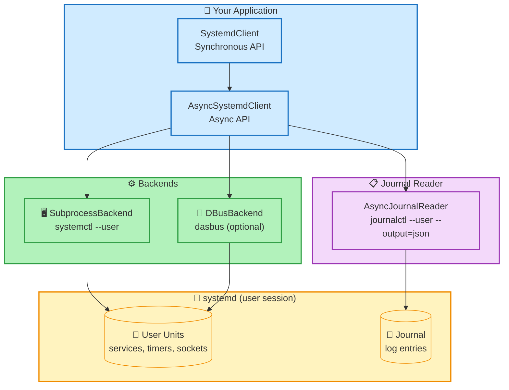

# systemd-client — High-Level Python Client for systemd User Services

<div align="center">


**Unified async + sync Python API for systemd unit management and journal reading**

**API unificada async + sync en Python para gestion de unidades systemd y lectura del journal**

---

### Choose Your Language / Elige tu idioma

<p align="center">
  <a href="README.en.md">
    
  </a>
  &nbsp;&nbsp;&nbsp;
  <a href="README.es.md">
    
  </a>
</p>

---

### Architecture Overview



### Quick Start

```bash
# Install
pip install systemd-client

# Install with DBus backend support
pip install systemd-client[dbus]

# Install with Pydantic models
pip install systemd-client[all]
```

```python
from systemd_client import SystemdClient

client = SystemdClient()
for unit in client.list_units(unit_type="service"):
    print(f"{unit.name}: {unit.active_state}")
```

---

**systemd-client** · [github.com/kalexnolasco/systemd-client](https://github.com/kalexnolasco/systemd-client)

&copy; 2026 kalexnolasco

</div>
