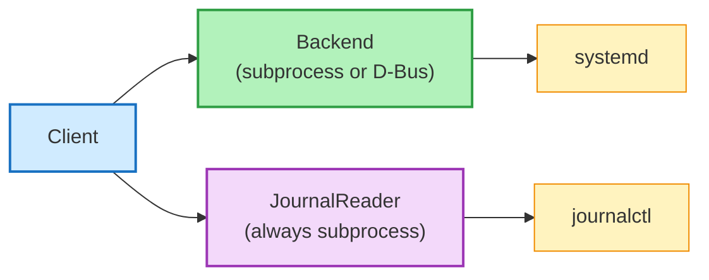

# Backends

systemd-client supports two backends for communicating with systemd. The backend only affects unit management operations — journal reading always uses subprocess.

## Backend Selection

```python
from systemd_client import SystemdClient, BackendType

# Auto (default): tries D-Bus, falls back to subprocess
client = SystemdClient(backend=BackendType.AUTO)

# Subprocess: shells out to systemctl --user
client = SystemdClient(backend=BackendType.SUBPROCESS)

# D-Bus: direct D-Bus communication via dasbus
client = SystemdClient(backend=BackendType.DBUS)
```

## Subprocess Backend

**Default. Recommended for most use cases.**

- Shells out to `systemctl --user` for each operation
- Parses JSON output (`--output=json`) for list operations
- Parses key=value output for status (`systemctl show`)
- Uses exit codes for boolean checks (is-active, is-enabled, is-failed)

**Pros:**

- Zero Python dependencies
- Works on any Linux with systemd
- Battle-tested — same commands you'd run manually

**Cons:**

- Spawns a subprocess per operation (minimal overhead in practice)

## D-Bus Backend

**Optional. Install with `pip install systemd-client[dbus]`.**

- Communicates directly via the D-Bus session bus
- Uses `dasbus` library (synchronous calls wrapped with `asyncio.to_thread`)
- Unit names are escaped for D-Bus object paths automatically

**Pros:**

- No subprocess spawning
- Slightly faster for bulk operations

**Cons:**

- Requires `dasbus` and system `libdbus`
- D-Bus session bus must be accessible
- More complex error handling

## Auto Detection

With `BackendType.AUTO` (default), the library tries:

1. Import `dasbus` and create a D-Bus backend
2. If that fails (import error, D-Bus not available), fall back to subprocess

```python
from systemd_client import SystemdClient

# This always works — worst case, uses subprocess
client = SystemdClient()
```

## Journal: Always Subprocess

The systemd journal has **no D-Bus API**. Regardless of backend choice, journal operations always run `journalctl --user --output=json` as a subprocess.


