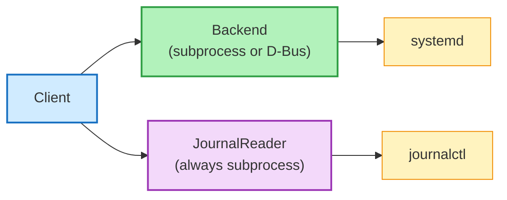

# Backends

systemd-client supports **two backends** for communicating with systemd. The backend only affects unit management operations -- journal reading always uses subprocess.

Let's understand how they work and when to use each one.

## Choosing a Backend

```python hl_lines="4 7 10"
from systemd_client import SystemdClient, BackendType

# Auto (default): tries D-Bus, falls back to subprocess
client = SystemdClient(backend=BackendType.AUTO)  # (1)!

# Subprocess: shells out to systemctl --user
client = SystemdClient(backend=BackendType.SUBPROCESS)  # (2)!

# D-Bus: direct communication via dasbus
client = SystemdClient(backend=BackendType.DBUS)  # (3)!
```

1. This is the default. It tries D-Bus first, and if that's not available, silently falls back to subprocess. **You always get a working client.**
2. Recommended for most use cases. Zero extra dependencies, works everywhere.
3. Requires `dasbus` and system `libdbus`. Install with `pip install systemd-client[dbus]`.

## Subprocess Backend

**This is the default and recommended backend for most use cases.**

It works by shelling out to `systemctl --user` for each operation -- the same commands you'd run in your terminal:

- Uses `--output=json` for list operations
- Parses key=value output for status (`systemctl show`)
- Uses exit codes for boolean checks (`is-active`, `is-enabled`, `is-failed`)

!!! tip
    The subprocess backend has **zero Python dependencies** beyond the standard library. If `systemctl` works in your terminal, this backend works in your code.

??? info "Technical Details"
    Each operation spawns a subprocess. In practice, the overhead is minimal -- `systemctl` is a lightweight binary that returns results in milliseconds. For most applications, you won't notice any difference compared to the D-Bus backend.

**Pros:**

- Zero Python dependencies
- Works on any Linux with systemd
- Battle-tested -- same commands you'd run manually

**Cons:**

- Spawns a subprocess per operation (minimal overhead in practice)

## D-Bus Backend

**Optional. Install with:**

```console
$ pip install systemd-client[dbus]
```

This backend communicates **directly** with systemd over the D-Bus session bus using the `dasbus` library.

- Uses synchronous D-Bus calls wrapped with `asyncio.to_thread`
- Unit names are escaped for D-Bus object paths automatically

**Pros:**

- No subprocess spawning
- Slightly faster for bulk operations

**Cons:**

- Requires `dasbus` and system `libdbus`
- D-Bus session bus must be accessible
- More complex error handling

!!! warning
    If the D-Bus session bus isn't available (common in containers, CI, or minimal environments), the D-Bus backend will raise `BackendNotAvailableError`. Use `BackendType.AUTO` or `BackendType.SUBPROCESS` in those situations.

## Auto Detection

With `BackendType.AUTO` (the default), the library tries this sequence:

1. **Try to import `dasbus`** and create a D-Bus backend
2. **If that fails** (import error, D-Bus not available), fall back to subprocess

```python hl_lines="3"
from systemd_client import SystemdClient

client = SystemdClient()  # (1)!
```

1. This **always works**. Worst case, it uses subprocess. You never need to worry about backend availability.

!!! note
    Auto detection happens once at client creation time. The backend doesn't change during the client's lifetime.

## Journal: Always Subprocess

Here's an important detail: the systemd journal has **no D-Bus API**.

Regardless of which backend you choose, journal operations always run `journalctl --user --output=json` as a subprocess.



!!! info
    This means you can use `BackendType.DBUS` for unit management and still get journal functionality. The two paths are completely independent.

??? info "Technical Details"
    Why no D-Bus for the journal? The `sd-journal` API is a C library, not a D-Bus service. While there's `systemd-journal-gatewayd`, it's rarely deployed. Parsing `journalctl --output=json` is the most reliable and portable approach.
