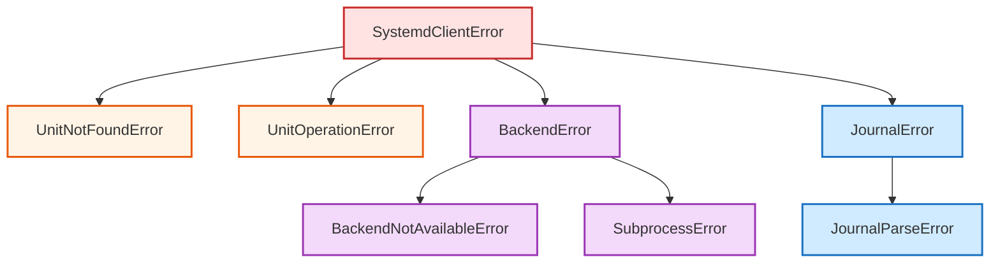

# Error Handling

All exceptions in systemd-client inherit from `SystemdClientError`, so you can catch everything with a single handler -- or be as specific as you need.

Let's walk through the exception hierarchy and see how to handle each one.

## Exception Hierarchy



!!! info
    The hierarchy is designed so you can catch at any level. Catch `SystemdClientError` for a safety net, or catch specific exceptions for fine-grained control.

## Catch-All Handler

The simplest approach -- catch `SystemdClientError` and handle everything in one place:

```python hl_lines="4 6"
from systemd_client import SystemdClient, SystemdClientError

client = SystemdClient()

try:
    client.restart("my-app.service")
except SystemdClientError as e:
    print(f"Something went wrong: {e}")  # (1)!
```

1. Every exception in the library inherits from this, so nothing escapes.

!!! tip
    This is great for scripts where you just want to log the error and move on. For production code, prefer catching specific exceptions so you can handle each case appropriately.

## Specific Exceptions

### UnitNotFoundError

Raised when a unit **doesn't exist**:

```python hl_lines="4 6"
from systemd_client import UnitNotFoundError

try:
    status = client.status("nonexistent.service")
except UnitNotFoundError as e:
    print(f"Unit not found: {e.unit_name}")  # (1)!
```

1. The `unit_name` attribute tells you exactly which unit was missing.

| Attribute | Type | Description |
|-----------|------|-------------|
| `unit_name` | `str` | The name of the unit that wasn't found |

### UnitOperationError

Raised when start/stop/restart/enable/disable/mask/unmask **fails**:

```python hl_lines="4 6"
from systemd_client import UnitOperationError

try:
    client.start("broken.service")
except UnitOperationError as e:
    print(f"Failed to {e.operation} {e.unit_name}: {e.detail}")  # (1)!
```

1. Gives you the operation that failed, the unit it was targeting, and a human-readable explanation.

| Attribute | Type | Description |
|-----------|------|-------------|
| `unit_name` | `str` | The target unit |
| `operation` | `str` | What was attempted (`"start"`, `"stop"`, etc.) |
| `detail` | `str` | Human-readable error message from systemd |

!!! note
    This means the unit **exists** but the operation couldn't complete. For missing units, you'll get `UnitNotFoundError` instead.

### BackendNotAvailableError

Raised when you request a backend that **can't be initialized**:

```python hl_lines="4 6"
from systemd_client import BackendNotAvailableError, BackendType

try:
    client = SystemdClient(backend=BackendType.DBUS)
except BackendNotAvailableError as e:
    print(f"Backend {e.backend} not available: {e.reason}")  # (1)!
```

1. Common reasons: `dasbus` not installed, D-Bus session bus not accessible.

| Attribute | Type | Description |
|-----------|------|-------------|
| `backend` | `str` | Which backend was requested |
| `reason` | `str` | Why it couldn't be initialized |

??? tip "Other options to avoid this error..."

    Use `BackendType.AUTO` (the default) and the library will silently fall back to subprocess if D-Bus isn't available:

    ```python
    client = SystemdClient()  # Always works
    ```

### SubprocessError

Raised when a subprocess command **exits with an unexpected error**:

```python hl_lines="4 6 7 8"
from systemd_client import SubprocessError

try:
    client.daemon_reload()
except SubprocessError as e:
    print(f"Command failed: {' '.join(e.command)}")
    print(f"Exit code: {e.returncode}")
    print(f"Stderr: {e.stderr}")  # (1)!
```

1. The `stderr` output usually contains the actual error message from `systemctl`.

| Attribute | Type | Description |
|-----------|------|-------------|
| `command` | `list[str]` | The full command that was executed |
| `returncode` | `int` | Process exit code |
| `stderr` | `str` | Standard error output |

!!! warning
    This is a low-level error from the subprocess backend. In most cases, you'll see a higher-level `UnitOperationError` or `UnitNotFoundError` instead. `SubprocessError` surfaces when something truly unexpected happens.

### JournalParseError

Raised when journal output **can't be parsed** as JSON:

```python hl_lines="4 6"
from systemd_client import JournalParseError

try:
    entries = client.journal("my-app.service")
except JournalParseError as e:
    print(f"Parse error: {e.detail}")  # (1)!
```

1. This is rare -- it typically means `journalctl` returned something unexpected.

| Attribute | Type | Description |
|-----------|------|-------------|
| `detail` | `str` | What went wrong during parsing |

## Pattern: Graceful Degradation

Now let's put it all together. Here's a real-world pattern that handles errors gracefully:

```python hl_lines="8 10 12 14"
from systemd_client import (
    SystemdClient,
    UnitNotFoundError,
    UnitOperationError,
)

def safe_restart(unit_name: str) -> bool:
    client = SystemdClient()
    try:
        client.restart(unit_name)
        return True
    except UnitNotFoundError:
        print(f"Unit {unit_name} not found -- skipping")  # (1)!
        return False
    except UnitOperationError as e:
        print(f"Restart failed: {e.detail}")  # (2)!
        return False
```

1. The unit doesn't exist. Maybe it hasn't been installed yet -- not necessarily a fatal error.
2. The unit exists but couldn't be restarted. Log the details and let the caller decide what to do.

!!! check
    With this pattern, your code handles both "unit missing" and "unit broken" cases without crashing.

??? tip "Other options for error handling strategies..."

    You can also combine the catch-all with specific handlers:

    ```python hl_lines="5 7 9"
    from systemd_client import SystemdClientError, UnitNotFoundError

    try:
        client.restart(unit_name)
    except UnitNotFoundError:
        return "not_found"  # Handle specifically
    except SystemdClientError:
        return "error"  # Catch everything else
    ```

    Python tries `except` blocks top-to-bottom, so put specific exceptions **before** the general ones.
