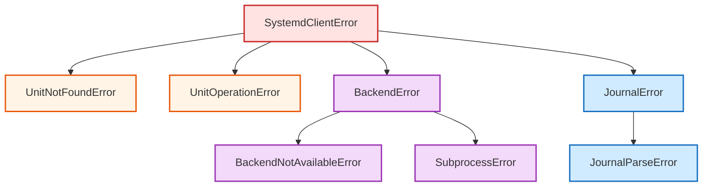

# Error Handling

All exceptions inherit from `SystemdClientError`, so you can catch everything with a single handler or be specific.

## Exception Hierarchy



## Catching All Errors

```python
from systemd_client import SystemdClient, SystemdClientError

client = SystemdClient()

try:
    client.restart("my-app.service")
except SystemdClientError as e:
    print(f"Something went wrong: {e}")
```

## Specific Exceptions

### UnitNotFoundError

Raised when a unit doesn't exist:

```python
from systemd_client import UnitNotFoundError

try:
    status = client.status("nonexistent.service")
except UnitNotFoundError as e:
    print(f"Unit not found: {e.unit_name}")
```

**Attributes:** `unit_name: str`

### UnitOperationError

Raised when start/stop/restart/enable/etc. fails:

```python
from systemd_client import UnitOperationError

try:
    client.start("broken.service")
except UnitOperationError as e:
    print(f"Failed to {e.operation} {e.unit_name}: {e.detail}")
```

**Attributes:** `unit_name: str`, `operation: str`, `detail: str`

### BackendNotAvailableError

Raised when requesting a backend that can't be initialized:

```python
from systemd_client import BackendNotAvailableError, BackendType

try:
    client = SystemdClient(backend=BackendType.DBUS)
except BackendNotAvailableError as e:
    print(f"Backend {e.backend} not available: {e.reason}")
```

**Attributes:** `backend: str`, `reason: str`

### SubprocessError

Raised when a subprocess command exits with unexpected error:

```python
from systemd_client import SubprocessError

try:
    client.daemon_reload()
except SubprocessError as e:
    print(f"Command failed: {' '.join(e.command)}")
    print(f"Exit code: {e.returncode}")
    print(f"Stderr: {e.stderr}")
```

**Attributes:** `command: list[str]`, `returncode: int`, `stderr: str`

### JournalParseError

Raised when journal output can't be parsed as JSON:

```python
from systemd_client import JournalParseError

try:
    entries = client.journal("my-app.service")
except JournalParseError as e:
    print(f"Parse error: {e.detail}")
```

**Attributes:** `detail: str`

## Pattern: Graceful Degradation

```python
from systemd_client import (
    SystemdClient,
    UnitNotFoundError,
    UnitOperationError,
)

def safe_restart(unit_name: str) -> bool:
    client = SystemdClient()
    try:
        client.restart(unit_name)
        return True
    except UnitNotFoundError:
        print(f"Unit {unit_name} not found — skipping")
        return False
    except UnitOperationError as e:
        print(f"Restart failed: {e.detail}")
        return False
```
