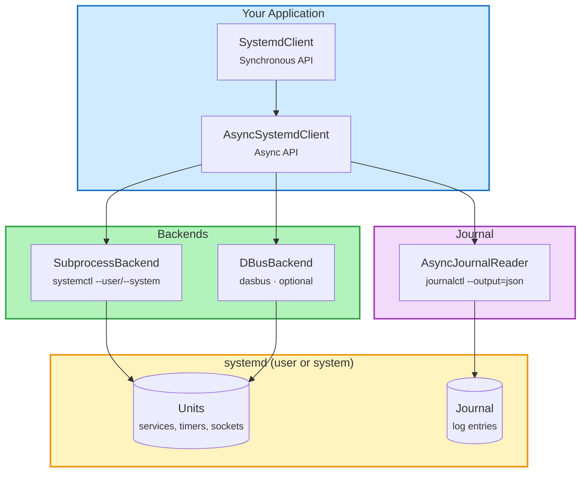

<div align="center" markdown>

# systemd-client

[](https://pypi.org/project/systemd-client/)
[](https://pypi.org/project/systemd-client/)
[](https://github.com/kalexnolasco/systemd-client/blob/main/LICENSE)
[](https://github.com/kalexnolasco/systemd-client/actions)

*A modern, Pythonic client for managing systemd services.*

</div>

---

**systemd-client** is a high-level Python library for managing **systemd services** -- both user and system scope. It gives you a clean, typed API instead of shelling out to `systemctl` and parsing text output by hand.

It is designed to be **easy to use**, **async-first** (with sync wrappers that feel just as natural), and **fully typed** so your editor and type checker can help you every step of the way.

The key ideas are:

- **Pythonic**: Frozen dataclasses, StrEnums, and full type annotations -- no string parsing.
- **Async-first**: Built on `asyncio` from the ground up. Use `AsyncSystemdClient` directly, or use the synchronous `SystemdClient` wrapper -- same API, same types.
- **Zero required dependencies**: The default subprocess backend calls `systemctl` under the hood and needs nothing beyond the standard library.
- **Pluggable**: Swap in the D-Bus backend for direct communication when you need it.
- **User + System scope**: Manage user session services (`--user`) or system-wide services (`--system`).

---

## Features

- **Async + Sync API** - `AsyncSystemdClient` for `async`/`await` code, `SystemdClient` as a synchronous wrapper. Both share the same interface and return the same typed models.
- **User + System Scope** - Manage user session services or system-wide services with `SystemdScope.USER` / `SystemdScope.SYSTEM`.
- **Pluggable Backends** - The default subprocess backend has zero dependencies. Install `systemd-client[dbus]` for a D-Bus backend via `dasbus` when you need direct communication.
- **Journal Reader** - Query and follow journal entries as structured `JournalEntry` objects. Filter by unit, priority, time range, or grep pattern.
- **Full Unit Management** - Start, stop, restart, reload, try-restart, reload-or-restart, enable, disable, mask, unmask, status, cat, reset-failed, daemon-reload, and batch operations.
- **Typed Models** - Frozen dataclasses with slots for `UnitInfo`, `UnitStatus`, `UnitFileInfo`, `JournalEntry`, and `EnableResult`. StrEnums for every state and priority level.
- **Context Managers** - Both clients support `with` / `async with` for proper resource cleanup.
- **Modern Python** - Requires Python 3.11+. Uses `StrEnum`, `slots=True` dataclasses, full PEP 561 type annotations.
- **CLI Included** - The `systemd-client` command gives you colored table output, `--json` mode, `--scope` selection, and batch operations.

---

## Installation

```console
$ pip install systemd-client
---> 100%
Successfully installed systemd-client
```

You can also install it with optional extras:

```console
$ pip install systemd-client[dbus]
```

```console
$ pip install systemd-client[all]
```

!!! tip
    You only need the base install for most use cases. The subprocess backend works
    everywhere `systemctl --user` is available -- no extra packages required.

---

## Example

### Create it

Create a file `main.py` with:

```python hl_lines="1 3 6 10"
from systemd_client import SystemdClient  # (1)!

with SystemdClient() as client:  # (2)!

    # List all running services in one call
    for unit in client.list_units(unit_type="service"):  # (3)!
        print(f"{unit.name}: {unit.active_state}")

    # Get detailed, typed status for a single unit
    status = client.status("my-app.service")  # (4)!
    print(f"PID {status.main_pid} running since {status.active_enter_timestamp}")
```

1. Import `SystemdClient` -- the synchronous client. For async code, use `AsyncSystemdClient` instead.
2. Use a context manager for proper resource cleanup. You can also create the client without `with`.
3. `list_units()` returns a list of `UnitInfo` dataclasses. Filter by `unit_type` or `state`.
4. `status()` returns a `UnitStatus` dataclass with typed fields like `main_pid`, `active_state`, and timestamps.

### Check it

Run it:

```console
$ python main.py
my-app.service: active
my-worker.service: active
PID 12345 running since 2026-03-31 08:00:00
```

!!! check
    You get back **real Python objects** -- frozen dataclasses with typed fields -- not
    raw strings from `systemctl` output.

---

### Async example

If you are building an async application, use `AsyncSystemdClient` directly:

```python hl_lines="1 5 8"
import asyncio
from systemd_client import AsyncSystemdClient

async def main():
    async with AsyncSystemdClient() as client:  # (1)!

        # Start a service and verify it is running
        await client.start("my-app.service")  # (2)!
        is_running = await client.is_active("my-app.service")
        print(f"Running: {is_running}")

asyncio.run(main())
```

1. Use `async with` for automatic resource cleanup. Same API shape as `SystemdClient`, but every method is a coroutine.
2. `start()`, `stop()`, `restart()`, `reload()`, `try_restart()`, `reload_or_restart()` -- all the operations you expect, as awaitable calls.

### Check it

```console
$ python main.py
Running: True
```

---

### Read the journal

Query journal entries as structured Python objects:

```python hl_lines="4 5"
from systemd_client import SystemdClient

client = SystemdClient()
entries = client.journal(unit="my-app.service", lines=5)  # (1)!
for entry in entries:
    print(f"[{entry.priority}] {entry.timestamp}: {entry.message}")  # (2)!
```

1. Returns a list of `JournalEntry` dataclasses. You can also filter by `since`, `until`, `priority`, and `grep`.
2. Each entry has typed fields: `message`, `priority`, `timestamp`, `pid`, `unit`, and more.

### Check it

```console
$ python main.py
[6] 2026-03-31 08:01:22: Server started on port 8080
[6] 2026-03-31 08:01:23: Accepting connections
[6] 2026-03-31 08:05:00: Healthcheck OK
[4] 2026-03-31 08:10:15: Connection pool nearing limit
[6] 2026-03-31 08:10:16: Scaled pool to 200 connections
```

!!! info
    You can also **follow** the journal in real time with `client.journal_follow()`,
    which yields entries as they arrive -- as a synchronous iterator or an async generator.

---

## Requirements

**systemd-client** requires **Python 3.11+** and a Linux system with systemd.

The base install has **zero Python dependencies** -- it calls `systemctl` and `journalctl` via subprocess.

Optional dependencies:

- `dasbus` -- for the D-Bus backend (`pip install systemd-client[dbus]`)
- `pydantic` -- for Pydantic model variants (`pip install systemd-client[pydantic]`)

!!! note
    The subprocess backend is the default and works on any system where `systemctl --user`
    is available. You do not need D-Bus unless you have a specific reason to use it.

---

## Architecture



`SystemdClient` is a thin synchronous wrapper around `AsyncSystemdClient`. Under the hood, every call goes through a pluggable backend (subprocess or D-Bus) to talk to your systemd user session. Journal reads go through a dedicated `AsyncJournalReader` that parses JSON output from `journalctl`.

---

## License

This project is licensed under the terms of the **MIT license**.
