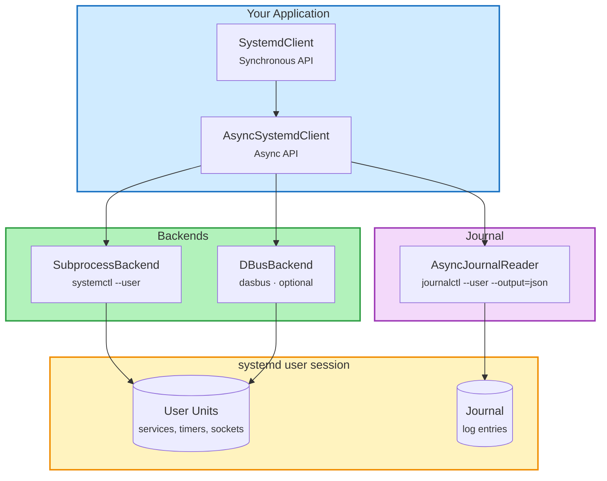

# systemd-client

<div align="center" markdown>

[](https://pypi.org/project/systemd-client/)
[](https://pypi.org/project/systemd-client/)
[](https://github.com/kalexnolasco/systemd-client/blob/main/LICENSE)
[](https://github.com/kalexnolasco/systemd-client/actions)

**High-level Python client for systemd user services**

*Async-first with sync wrappers, subprocess + optional D-Bus backends, CLI included.*

</div>

---

## Why systemd-client?

Managing systemd user services from Python typically means shelling out to `systemctl` and parsing text output. **systemd-client** gives you a clean, typed API that works the way you'd expect:

```python
from systemd_client import SystemdClient

client = SystemdClient()

# One line to check all your services
for unit in client.list_units(unit_type="service"):
    print(f"{unit.name}: {unit.active_state}")

# Typed results, not string parsing
status = client.status("my-app.service")
print(f"PID {status.main_pid} running since {status.active_enter_timestamp}")
```

## Key Features

| | Feature | Description |
|:-:|---------|-------------|
| **:material-sync:** | **Async + Sync** | Async-first design with synchronous wrappers. Use `AsyncSystemdClient` or `SystemdClient` — same API, same types. |
| **:material-cog:** | **Pluggable Backends** | Subprocess backend (zero deps, default) or D-Bus via dasbus for direct communication. |
| **:material-text-box-search:** | **Journal Reader** | Query and follow journal entries with structured `JournalEntry` objects. Filter by unit, priority, time range, grep. |
| **:material-wrench:** | **Full Unit Management** | Start, stop, restart, reload, enable, disable, mask, unmask, status — everything `systemctl --user` does. |
| **:material-language-python:** | **Modern Python** | Python 3.11+ with StrEnum, frozen dataclasses, full type annotations, PEP 561 typed. |
| **:material-console:** | **CLI Included** | `systemd-client` command with colored table output and JSON mode. |

## Architecture



## Quick Install

```bash
pip install systemd-client
```

Optional extras:

=== "D-Bus backend"

    ```bash
    pip install systemd-client[dbus]
    ```

=== "Pydantic models"

    ```bash
    pip install systemd-client[pydantic]
    ```

=== "Everything"

    ```bash
    pip install systemd-client[all]
    ```
